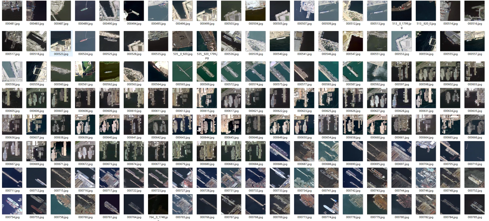
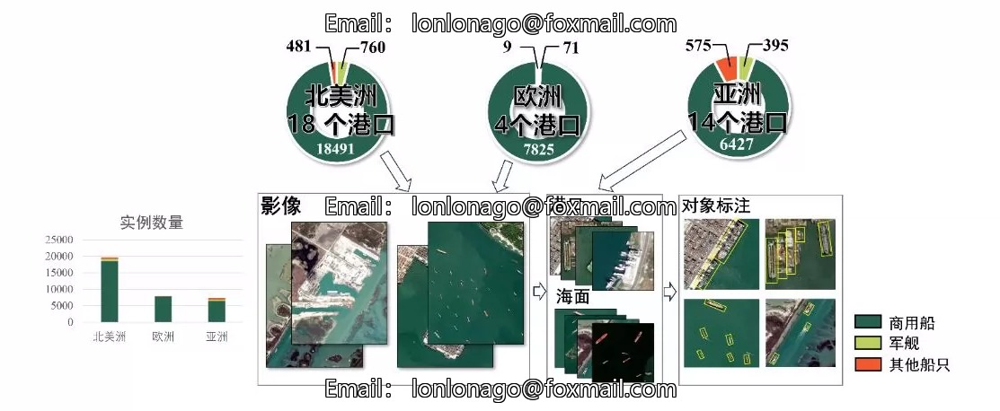
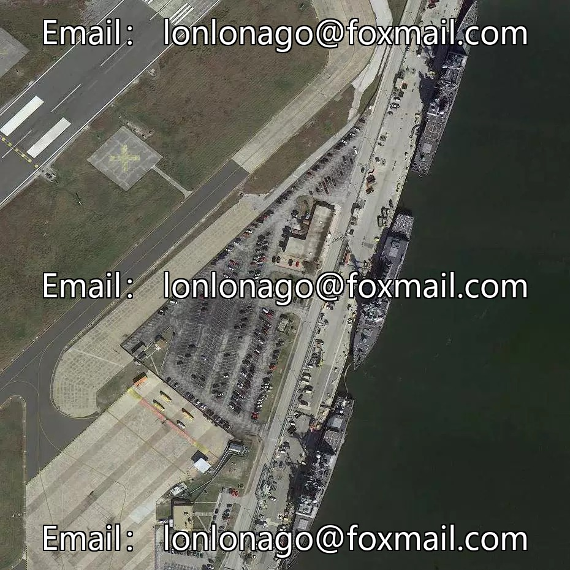
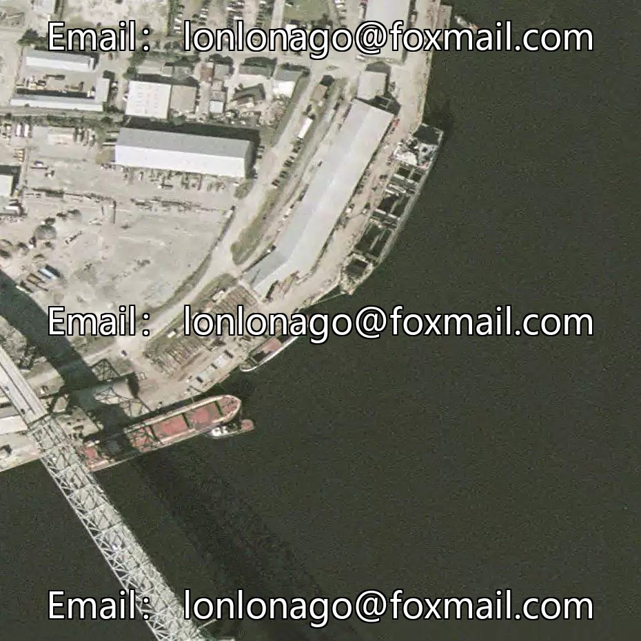
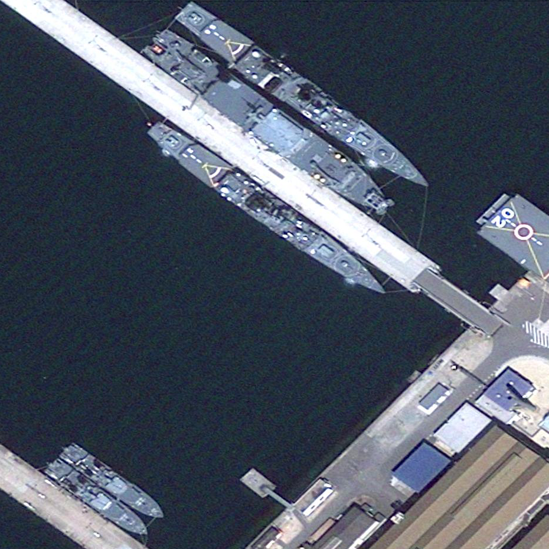
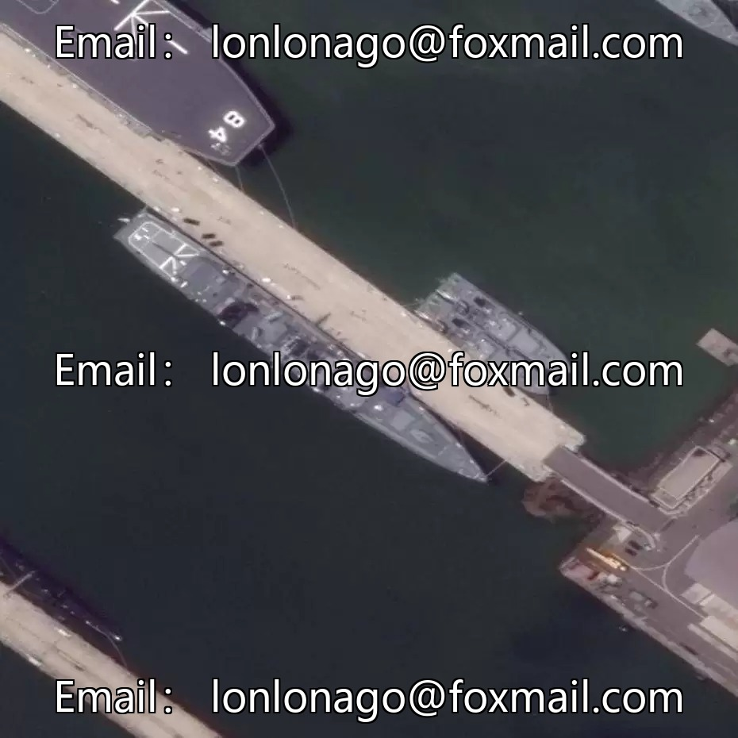

## Body

Large-Scale Port Ship Instance Target Detection Dataset

This dataset is collected from 36 major ports, comprising 8000 high-resolution images and 48717 annotated instances, covering 49 different sizes, resolutions, and imaging qualities of ships.

The original image size ranges between 512×512 to 930×930 pixels.

Containing the author's source article

Electronic virtual products are not returnable or exchangeable.

## Images

item_1063026896743

Here is a pay link on Stripe ( https://buy.stripe.com/3cs8yP7sY87d0vu9AB ). Please contact me lonlonago@foxmail.com after funding $89, and I will send you a complete data files , thank you!

